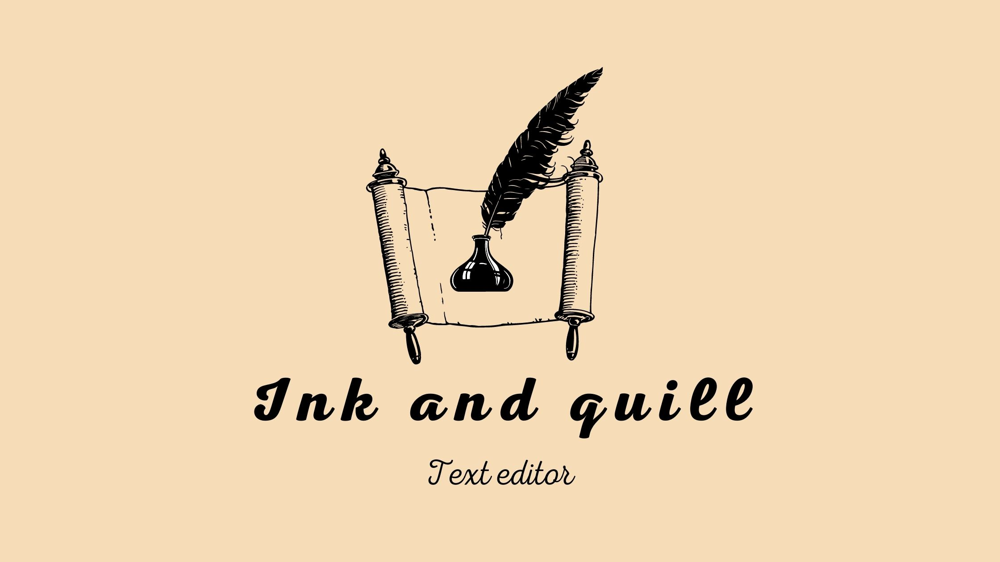

	

<h1 align="center">📜 Ink and Quill - Text Editor 📜</h1>

## Project description

  A WYSIWYG editor built for web, providing a wide variety of features, Since formatting selected characters until adding images and videos to the document

 

## Content table
	
- [Features](#features)
- [Used technologies](#tech)
- [Author](#author)
- [License](#license)

<h4 align="center" >
	🚧 Ink and Quill 📜 Under development 🚧
</h4>

<h2 id="features">Features</h2>

<h6>Text formatting</h6>

- [x] Bold
- [x] Italic
- [x] Underlined
- [x] Sub-script
- [x] Superscript

<h6>Text align</h6>

- [ ] Left
- [ ] Center
- [ ] Right
- [ ] Justified

<h2 id="tech">Used technologies</h2>

- [Bootstrap](https://getbootstrap.com/)

<h2 id="author">Author</h2>

<a href="#">
	
 	 
	<b>Jackson Monteiro</b></a> 
 </a>

Made with ❤️ by Jackson Monteiro. Contact us!

<h2 id="license">License</h2>

This project is under license [GLP-3.0](https://github.com/JacksonMonteiro/ink-and-quill-text-editor/blob/main/LICENSE)
